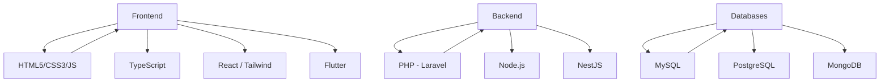

# 👋 Hello, there!  

#### I'm **Cleison Freitas**, a PHP and JavaScript developer passionate about building high-performance and scalable applications.   

#### I specialize in backend development with **Laravel**, **Node.js**, and **NestJS**, crafting clean and efficient solutions that scale.   

#### On the frontend side, I have solid experience with **TypeScript**, **React**, and **Tailwind CSS**, allowing me to deliver full-stack applications with seamless user experiences.   

#### I love exploring modern technologies and bringing them into my projects, creating applications that are responsive, user-friendly, and future-proof.   

#### Let’s connect and build innovative ideas together! 🌐🚀  

  
  
  

---

## 💼 Technologies & Experience  

### 🚀 Frontend  

  
  
  
  
  
  

  

### ⚡ Backend  

  
  

 

### 🗄️ Database  

  
  
  

  

---

## 📊 GitHub Stats  

  
  
  

---

## 🛠️ My Tech Stack Roadmap  

## 📫 Contact Me
### 📧: cleison.npi@gmail.com
